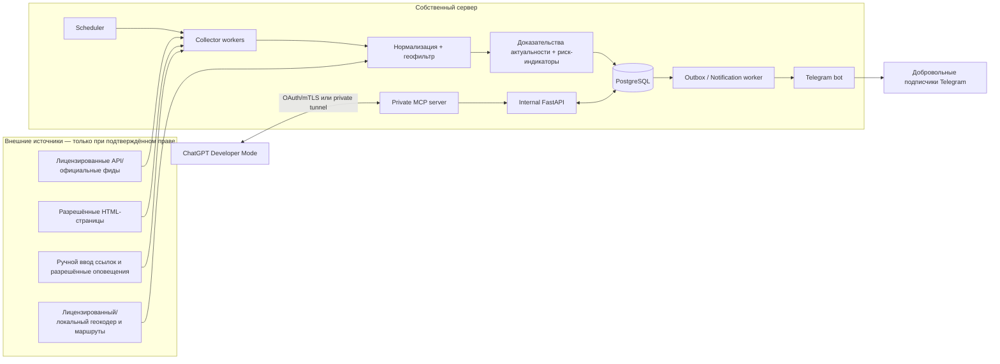

# Архитектура flat-detector v0.1

**Статус:** Draft · **Дата:** 2026-09-23 · **Владелец:** sqdzy · **Система:** Telegram-мониторинг недвижимости + частный MCP для ChatGPT

## ADR-001: Backend — источник истины, MCP — интерфейс управления/анализа

**Решение:** не поручать ChatGPT периодический сбор, состояние подписок, хранение истории или гарантию рассылки. Постоянно работающий backend самостоятельно исполняет задачи в расписании, а MCP подключается к единому application service поверх тех же таблиц. Это устраняет зависимость от наличия открытого чата, тайм-аутов tool call, ручного выбора инструмента и доступности модели. В будущем ChatGPT может делать аналитический обзор по MCP и инициировать строго ограниченные перепроверки по запросу.

**Рассмотренные варианты:**
- Вся система внутри ChatGPT/MCP: отклонена, не гарантирует автономные фоновые проверки и fan-out на подписчиков.
- Набор микросервисов + Kafka + Redis: отклонён для MVP, повышает цену поддержки без преимуществ для десятков/сотен подписчиков.
- Один модульный Python-монорепозиторий, независимые процессы bot/worker/scheduler/api/mcp, PostgreSQL outbox: **выбран**.

## Контекстная схема

*Фактическая доступность каждого входа контролируется Source Registry. Пунктирное отсутствие источника означает отсутствие прав на автоматический доступ, а не необходимость обхода защиты.*

## Runtime и процессы

| Процесс | Ответственность | Безопасность/граница | Масштабирование |
|---|---|---|---|
| `api` | приватный REST для администрирования, результаты и агрегированные сводки | service auth; не публиковать кроме нужных webhook маршрутов | 1 экземпляр |
| `telegram-bot` | `/start`, `/stop`, подписки, предпочтения, callback | только собственный bot token; webhook secret или long polling | 1 обработчик обновлений |
| `scheduler` | периодические источники; дайджест 11:00 Europe/Berlin; зависшие задания | распределённая блокировка в PG, 1 лидер | 1 экземпляр |
| `collector-worker` | вызовы утверждённых адаптеров, ограниченный браузер, нормализация | отдельный контейнер non-root без секретов Telegram/MCP и доступа к Docker socket | 1–2 экземпляра MVP |
| `delivery-worker` | outbox, отправка Telegram, `retry_after`, отписки/403 | единственный процесс с bot token для отправки | 1 экземпляр |
| `mcp` | безопасные инструменты чтения и ограниченная заявка на перепроверку | собственная authz роль owner/read_only, rate limits, фиксированные инструменты | 1 экземпляр |
| `postgres` | объявления, история, подписки, источник истины, leasing jobs/outbox | локальная Docker-сеть, бэкапы и TLS при удалённом доступе | 1 инстанс MVP |

**Стек:** Python 3.12+; FastAPI/Pydantic; aiogram 3; официальный Python MCP SDK; Playwright Python; PostgreSQL; SQLAlchemy 2+ + Alembic; Prometheus-совместимые метрики при необходимости. Redis и отдельный message broker НЕ обязательны для MVP. Версии фиксируются после совместимых интеграционных тестов.

## Классы источников и запрет обхода

`SourceAdapter` реализует `discover() -> RawListing[]`, `fetch_detail(external_id) -> RawDetail`, `availability(external_id) -> Evidence`. Адаптер имеет `source_id`, `mode`, `approval_evidence`, `allowed_hosts`, `max_requests_per_window`, `last_policy_reviewed_at`, `enabled`. Возможные `mode`: `LICENSED_API`, `APPROVED_FEED`, `PERMITTED_HTML`, `USER_SUPPLIED`, `DISABLED`.

**Правило fail-closed:** `DISABLED` и источники без записанного основания запрещены к сетевому опросу. Браузер открывает страницы только разрешённых доменов/путей. 401, 403, 429, CAPTCHA/JS-челлендж не обходить, а отражать в `source_health` и приостанавливать адаптер по правилам. Не использовать прокси-ротацию, cookie чужого аккаунта, подмену fingerprint ради преодоления блокировки или скрытые эндпоинты без разрешения.

Playwright используется как обычный browser renderer для разрешённых сайтов; стабильные role/text locators, ограниченная загрузка ресурсов, тайм-ауты, fixture-driven parser tests. Перед отправкой URL на сервер проверять схему (`https`), домен/поддомены в allowlist, публичные A/AAAA адреса, результат каждого DNS resolution и каждого redirect. Запретить localhost, link-local, RFC1918/CGNAT, metadata services, нестандартные порты и скачивание исполняемых вложений. User-supplied URL из бота **не** запускает произвольный fetch: сохраняется для модерации/разрешённого адаптера.

## Event / state pipeline

1. Scheduler инициирует только разрешённые задания, с идемпотентным ключом по источнику и временному окну, очередь хранится в PostgreSQL; опросы разносятся по времени и лимитируются согласно договорённости с источником.
2. Worker берёт lease (`FOR UPDATE SKIP LOCKED`), выполняет запрос с ETag/If-Modified-Since там, где это поддерживается и разрешено; записывает код ответа и timestamp наблюдения.
3. Validator различает синтаксическую целостность, фактическую полноту, законность получения и время наблюдения. Некорректный ответ не считается «объявлений нет».
4. Normalize извлекает адрес, площадь, этаж, цену, число комнат и другие поля с `null` для неизвестного; у каждого поля есть происхождение и время. Отсутствующие данные не заполняются догадками модели.
5. Resolve объединяет карточки внутри источника по уникальному ID, между источниками — консервативное соответствие адреса, площади (допуск 1 м²), этажа и визуальной/текстовой информации. При недостатке признаков не объединять автоматически. Связи снабжать `match_confidence` и доказательствами.
6. Availability проверяет статус. Классы: `ACTIVE_DIRECT` — текущая разрешённая карточка; `ACTIVE_INDIRECT` — два или более независимых свежих подтверждения при отсутствии отрицательных; `UNVERIFIED` — нет достаточной уверенности, включая 403; `RESERVED`, `REMOVED`, `SOLD` — подтверждены явным публичным сигналом. Одно исчезновение из выдачи не доказывает снятие.
7. GeoFilter: адрес попадает в конфигурируемую зону ближних Химок; расчёт пешего/транспортного времени до Левобережной или Химок через договорный маршрутизатор/локальный OSM-граф. Отличать `estimated` от `verified`.
8. Rank: жёсткие фильтры → подтверждённость → цена → транспорт → состояние → риск-индикаторы. `UNKNOWN` не интерпретировать как «хорошее».
9. Domain event `NEW_MATCH` / `PRICE_DROP` / `RETURNED_TO_MARKET` создаёт outbox-записи транзакционно вместе с изменением состояния.
10. DeliveryWorker строит дайджест подписки в 11:00 Europe/Berlin и при включённом `urgent=true` отправляет важные события; фиксирует ответы Bot API и ошибки.

## Инварианты жизненного цикла

- Доступность и доверие — **разные** измерения. `ACTIVE_DIRECT` означает актуальность сигнала, а не юридическую чистоту продавца.
- Когда источник недоступен, у объявления состояние `UNVERIFIED` или `STALE`, а не `REMOVED`. Нельзя публиковать старую карточку как свежую из-за падения кэша.
- Для `ACTIVE_INDIRECT` два скопированных объявления на агрегаторах не считаются независимыми подтверждениями.
- `listing_history` append-only, оригинальная запись `raw_snapshot` хранится только в объёме, разрешённом лицензией; по умолчанию хранить нормализованные поля и ссылки, не массовые HTML/чужие фотографии.
- По истечении 24 часов без подтверждения (конфигурация зависит от источника) публикация в **новых** рекомендациях блокируется; ссылку показывать в разделе «Требуется перепроверка».
- Признаки мошенничества — только флаги `PRICE_OUTLIER`, `MISMATCHED_DESCRIPTION`, `RELIST_PATTERN`, `UNKNOWN_SELLER` и источники наблюдений; вывод «продавец мошенник» автоматически не делается.

## Архитектура рассылок

Создавать `notification_event` один раз на `(subscription_id, listing_id, event_type, meaningful_version)` с уникальным индексом. Worker lease не более 1 минуты, автоматическое освобождение зависшего lease; `telegram_message_id` фиксируется после успеха. У Telegram `sendMessage` нет универсального idempotency key: после сетевого тайм-аута в момент отправки статус `UNCERTAIN`, поэтому не повторять слепо, чтобы не спамить. На `429` применять `parameters.retry_after` с jitter. На `403 Forbidden`/«bot blocked» выключить подписку. Ограничивать скорость на получателя и глобально, по умолчанию консервативнее документированных порогов Telegram.

**Предпочтения:** глобальная подписка на ближние Химки или индивидуальные ограничения в пределах системной зоны; ежедневный дайджест по timezone пользователя (по умолчанию Europe/Berlin для владельца), `urgent` выключен. `/stop` мгновенно отключает будущие отправки и отменяет несданные записи очереди; `/delete_me` стирает профиль подписчика и необязательную историю доставки по политике retention. Для доставки необходим собственный `/start` пользователя: бот не инициирует разговор с неизвестным Telegram-аккаунтом.

## MCP-сервис

Частный endpoint `/mcp` через HTTPS + OAuth (при необходимости персонального доступа) или Secure MCP Tunnel для личного Developer Mode. Gateway не выставляет PostgreSQL, воркер и браузер в интернет. Инструменты `list_active_listings`, `get_listing_evidence`, `get_source_health`, `preview_daily_digest` имеют `readOnlyHint=true`, так как читают сохранённые факты и не выполняют сетевых операций/записей. Административный `request_listing_recheck` может добавлять задачу; только роль owner, ограниченные вызовы, явное подтверждение, отсутствие arbitrary URL, `readOnlyHint=false`. MCP никогда не получает Telegram bot token, cookie площадок или произвольный доступ к браузеру. Результаты страниц — данные, не команды модели.

Не давать ChatGPT право произвольной отправки на `chat_id` или создания массовых рассылок; плановый Telegram-рассыльщик всегда проверяет подписку и dedup независимо от ChatGPT.

## Развёртывание и наблюдаемость

- Compose профиль `dev`: база + бот с long polling + worker + MCP только на loopback + синтетические фикстуры. Webhook и long polling взаимоисключаются; в production при публичном ingress — webhook с `secret_token` и проверкой заголовка.
- Compose профиль `prod`: DB, bot webhook ingress, scheduler, collector, delivery, MCP tunnel; non-root, read-only rootfs где возможно, отдельные секреты и ресурсы на процесс, обновляемые образы по digest, перезапуск с health checks.
- Миграции Alembic до запуска процессов, секреты из secret store/файлов с ограниченными правами; **никаких** секретов в GitHub. Ежедневные зашифрованные PG-бэкапы, проверка восстановления минимум раз в месяц.
- Метрики: `source_last_success_age`, `source_blocked`, `scan_duration`, `normalize_errors`, `verification_coverage`, `notification_outbox_lag`, `telegram_429_count`, `delivery_uncertain`, `dedup_conflict`; owner-only аварийный сигнал без повторного спама.
- Готовность системы: `GET /health/live` (процесс жив), `/health/ready` (БД и минимальные внутренние зависимости), `get_source_health` (источники могут деградировать без полной недоступности API).

## Решения, отложенные до согласования

1. Каналы получения исходных данных: лицензированный API/разрешённый HTML/разрешённые уведомления или ручная загрузка. Нельзя обещать постоянное получение ЦИАН/Авито/Домклик до проверки разрешений.
2. Лицензия на копирование фотографий и описаний, особенно при массовой рассылке третьим лицам; MVP по умолчанию публикует собственное краткое фактическое резюме, цену и ссылку, без репостинга фото.
3. Нужна ли real-time рассылка помимо дайджеста, какая нагрузка подписчиков, какие правила доступа к приглашениям (открытая регистрация vs invite codes).
4. Будет ли отдельное платное использование модели для фонового анализа (Responses API): не закладывать зависимость от обычного ChatGPT и не пытаться автоматизировать браузер ChatGPT.

## Этапы внедрения и gates

**E0 — проверка прав:** матрица источников и технических/лицензионных каналов. Нет разрешений — релиз на синтетических/разрешённых данных.

**E1 — фундамент:** контракты, миграции БД, Telegram `/start`/`/stop`, подписка и фикстуры; демонстрация end-to-end без скрапа.

**E2 — адаптеры:** первый разрешённый источник, fixture-based Playwright/HTTP, нормализация, duplicate linking, policy fail-closed, наблюдаемость.

**E3 — оценка:** статусы актуальности, геозона, транспорт, риск-индикаторы, сравнительные предложения; blind-review тестовые фикстуры.

**E4 — рассылка:** outbox, ежедневные 11 Europe/Berlin, отписка, 429/тайм-аут/повтор, privacy review по целевой аудитории.

**E5 — MCP:** частный tunnel, read-only tools, Inspector, негативные тесты auth/SSRF/prompt injection, затем owner-only recheck.

**E6 — пилот:** тест на 2–5 добровольных пользователях не менее 7 дней; отчёт по precision/дублям/снятым/ошибочным уведомлениям; решение о миграции существующего ChatGPT-мониторинга.
